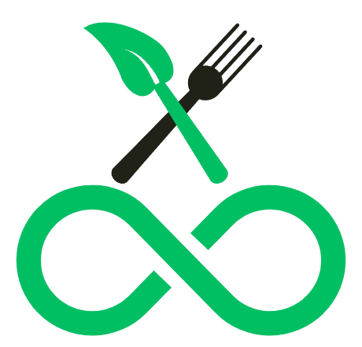

# 🌱 FoodLoop

*A sustainable food marketplace connecting communities to reduce waste and support local businesses*

**🏆 TSA Washington State 2025 Software Development Entry**  
*Foundation for our TSA Nationals 2025 Entry - see [native branch](https://github.com/TechnoTalksDev/foodloop/tree/native) for the full nationals implementation*

## � About FoodLoop

FoodLoop is a web-based sustainable food marketplace that connects consumers with local businesses to purchase surplus food at discounted prices. Our platform creates a comprehensive solution for environmental sustainability and economic savings by:

- **🌍 Reducing Food Waste** - Preventing quality food from ending up in landfills
- **💰 Saving Money** - Offering consumers significant discounts on fresh food
- **🌱 Helping the Environment** - Reducing CO₂ emissions from food waste
- **🏪 Supporting Local Businesses** - Creating new revenue streams for partnerships

Partnering with local businesses such as our own student store to reduce waste in our community!

## ⚡ Quick Start

### Prerequisites

- Node.js 18+
- Bun package manager (recommended) or npm
- Supabase account with configured project

### Installation

```bash
# Clone the repository
git clone https://github.com/TechnoTalksDev/foodloop

# Navigate to the project directory
cd foodloop

# Install dependencies
bun install
# or
npm install
```

### Environment Setup

```bash
# Copy environment template
cp .env.example .env

# Add your Supabase credentials
EXPO_PUBLIC_SUPABASE_URL=your_supabase_url
EXPO_PUBLIC_SUPABASE_ANON_KEY=your_supabase_anon_key
```

### Development

Start the development server:

```bash
bun run dev
# or
npm run dev
```

The app will be available at [http://localhost:5173](http://localhost:5173).

### Building

FoodLoop can be built as a standalone Node server, a Docker container, or an Azure Static Web Application.

#### How to change platforms

To build for either a standalone server or docker container, you must first change `svelte.config.js` to reflect this:

**For Azure SWA (Default):**

```js
import azure from 'svelte-adapter-azure-swa';
import { vitePreprocess } from '@sveltejs/vite-plugin-svelte';

/** @type {import('@sveltejs/kit').Config} */
const config = {
	extensions: ['.svelte'],
	preprocess: [vitePreprocess()],
	kit: {
		adapter: azure()
	}
};
export default config;
```

**For Node/Docker:**

```js
import adapter from '@sveltejs/adapter-node';
import { vitePreprocess } from '@sveltejs/vite-plugin-svelte';

/** @type {import('@sveltejs/kit').Config} */
const config = {
	extensions: ['.svelte'],
	preprocess: [vitePreprocess()],
	kit: {
		adapter: adapter()
	}
};
export default config;
```

## 🛠️ Tech Stack & Best Practices

### SvelteKit

FoodLoop is built with SvelteKit, a framework for building web applications of all sizes that delivers exceptional performance with minimal JavaScript by compiling to native JavaScript vs. React's virtual DOM approach.

### TypeScript

We use TypeScript throughout the project to catch errors early and improve the developer experience:

- Provides type safety and better tooling
- Improves code maintainability and refactoring
- Makes collaboration easier with explicit interfaces

### Code Formatting & Style

We follow consistent coding styles with:

- **Prettier**: Keeps code formatting consistent
- **ESLint**: Ensures code quality and catches potential issues

```bash
# Format code with Prettier
npm run format

# Lint code with ESLint
npm run lint
```

### Component Structure

The UI is built with reusable components following these principles:

- Small, single-responsibility components
- Clearly documented props and events
- Consistent naming conventions

### Accessibility

We prioritize accessibility in our UI components:

- Semantic HTML5 elements
- ARIA attributes when necessary
- Keyboard navigation support

## 🏆 TSA Competition Details

### Washington State Entry (Current Branch)
This main branch represents our **TSA Washington State 2025 Software Development Entry**, featuring:

- **Web-based Platform**: Built with SvelteKit for optimal performance
- **Core Marketplace**: Business listing system with cart functionality
- **AI Integration**: SmartPlate recipe generation using Google Gemini
- **Authentication**: Secure OAuth with Google and GitHub
- **Database**: Supabase backend with PostgreSQL
- **Responsive Design**: TailwindCSS with accessibility focus

### Nationals Enhancement (Native Branch)
Our [native branch](https://github.com/TechnoTalksDev/foodloop/tree/native) contains the **full TSA Nationals 2025 implementation** with enhanced features for Nashville, Tennessee, including:

- **Mobile Application**: React Native + Expo for cross-platform native experience
- **Advanced Community Features**: Forums, groups, and messaging systems
- **Garden Management**: Plant tracking with calendar integration
- **Real-time Features**: Live chat, notifications, and cart synchronization
- **Impact Analytics**: Environmental impact tracking and achievements
- **Enhanced AI**: Plant disease diagnosis and personalized recommendations

## 📈 Environmental Impact

FoodLoop addresses the critical issue of food waste, which accounts for **40% of the US food supply**. Our platform provides measurable environmental benefits:

- **CO₂ Emission Reduction**: Track saved emissions from prevented food waste
- **Resource Conservation**: Water and energy savings metrics
- **Community Education**: Sustainable practices promotion
- **Local Business Support**: New revenue streams for surplus inventory

## 🤝 Contributing

We welcome contributions from the community! Whether you're fixing bugs, adding features, or improving documentation, your help makes FoodLoop better for everyone.

## 📄 License

This project is licensed under the MIT License - see the [LICENSE](LICENSE) file for details.

---

**Built with ❤️ for TSA Washington State 2025 • Enhanced for TSA Nationals 2025 in Nashville, Tennessee**

## ✨ Key Features

### 🛒 Smart Marketplace
- Real-time inventory of surplus food from local businesses
- Advanced filtering by category, price, location, and dietary preferences
- Smart cart system with instant updates
- Secure checkout with integrated payment processing

### 🤖 AI-Powered SmartPlate Advisor
- Recipe generation using Google Gemini AI
- Personalized recommendations based on available ingredients
- Smart ingredient combination suggestions
- Waste reduction through creative recipe ideas

### 👤 User Management & Authentication
- Secure Google and GitHub OAuth integration
- Comprehensive user profiles with impact tracking
- Business and consumer account management
- Session management with Supabase Auth

### 💬 Business Tools
- Intuitive product listing creation with image upload
- Inventory management for surplus food items
- Location-based business discovery
- Pricing and expiration date management

### 📱 Responsive Design
- Mobile-first responsive interface
- Accessibility-focused UI components
- Modern design system with TailwindCSS
- Cross-platform compatibility


